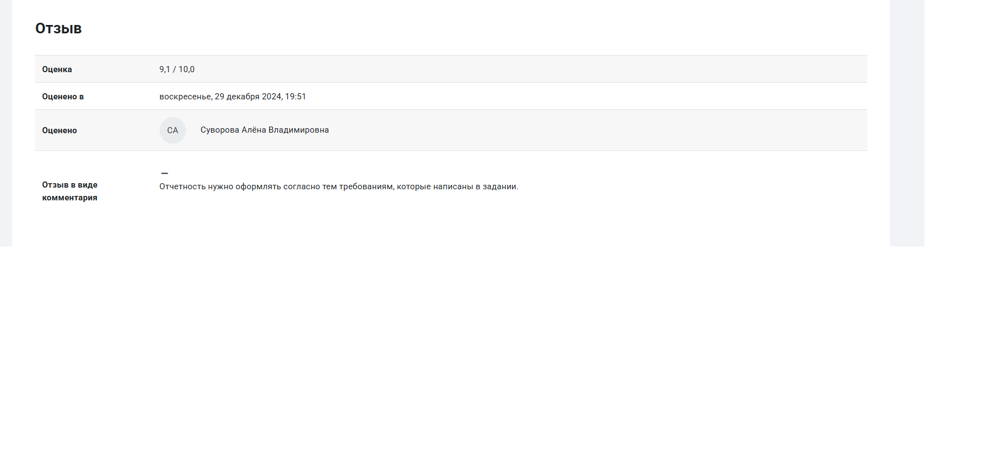

# Bank Churn Analysis

## 📌 О проекте

Проект выполнен в рамках курса **"Предиктивные модели и прикладная аналитика"** (модуль SQL майнора НИУ ВШЭ, 3 семестр).

**Цель:** анализ данных об оттоке клиентов банка и представление результатов в компактной и понятной форме (отчёт + дашборд).

**Задачи:**
- Подключение к базе данных ClickHouse (только необходимые данные)
- Построение графика оттока по возрастным группам
- Обучение модели логистической регрессии для предсказания оттока
- Создание интерактивного дашборда (Shiny) с фильтром по возрасту

---

## 📁 Содержимое репозитория

| Файл | Описание |
|------|----------|
| `analysis.Rmd` | Исходный код на R (пароль удалён) |
| `report.html` | HTML-отчёт с анализом и выводами (код скрыт, кнопка *Show/hide code*) |
| `Задание.png` | Скриншот задания |
| `Оценка+отзыв.png` | Скриншот оценки и отзыва |

> ⚠️ **Важно:** 
> - Пароль от ClickHouse удалён из кода в целях безопасности
> - **Rmd-код не может быть выполнен**, но результаты сохранены в HTML-отчёте

---

## 🔍 Что было сделано

### Подключение к базе данных
- Использован ClickHouseHTTP для подключения к удалённой БД
- Данные загружаются точечными SQL-запросами (без перегрузки окружения)

### Анализ оттока
- Построен график распределения ушедших клиентов по возрастным группам (10-летние интервалы)

### Моделирование
- **Модель:** логистическая регрессия
- **Признаки:** Age, CreditScore, Balance, NumOfProducts, HasCrCard, IsActiveMember
- **Целевая переменная:** Exited (1 — ушёл, 0 — остался)

**Метрики качества:**
| Метрика | Значение |
|---------|----------|
| Accuracy | ~0.81 |
| AUC-ROC | ~0.85 |

### Пример работы модели
Для конкретного клиента модель предсказывает вероятность оттока с выводом рекомендации (группа риска / надёжный клиент).

### Дашборд (Shiny)
- **Одна страница, без вкладок**
- **Интерактивный график:** отток по возрастным группам (Работает при непосредственном запуске кода)
- **Элемент управления:** слайдер для выбора возрастного диапазона

> ⚠️ Дашборд требует запуска R-сервера и не работает в статическом HTML-файле.

---

## 🎓 Оценка

**Оценка:** 9.1 / 10.0

---

## 🚀 Как просмотреть

1. **Отчёт:** откройте `report.html` в браузере
2. **Код:** нажмите кнопку *Show/hide code* в правом верхнем углу отчёта
3. **Дашборд:** требует запуска RStudio (не работает в статическом HTML) (Но если пользователь имеет аккаунт на CLickHouse и запустит код из
   своего аккаунта, то дэшборд будет поддерживаться локально)

---

## 🛠 Инструменты

- R
- DBI, ClickHouseHTTP (подключение к БД)
- ggplot2 (визуализация)
- caret, pROC (моделирование и метрики)
- shiny (интерактивный дашборд)

---

## 📌 Автор

Подолин Дмитрий  
НИУ ВШЭ, курс "Предиктивные модели и прикладная аналитика"
